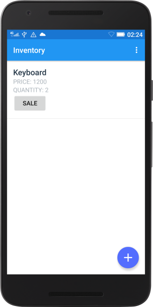

# InventoryApp (Stage2)
An Inventory App that allows a store to keep track of its inventory of products. The project is part of the "Android Basics Nanodegree by Google - Udacity". (#madewithudacity #googleudacityscholars #fendproject)

  

